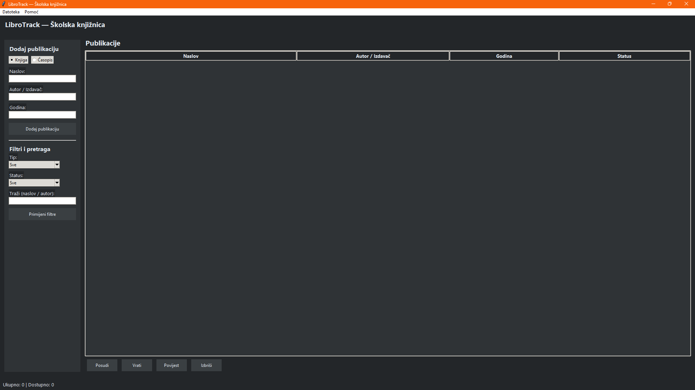

# LibroTrack

## O aplikaciji
Aplikacija za upravljanje školskom knjižnicom. Omogućuje dodavanje publikacija, posudbu, vraćanje i pregled povijesti.

## Pokretanje
1. Instaliraj Python 3.x
2. Instaliraj potrebne biblioteke: `pip install -r requirements.txt`
3. Pokreni skriptu: `python knjiga.py`

## Screenshot

